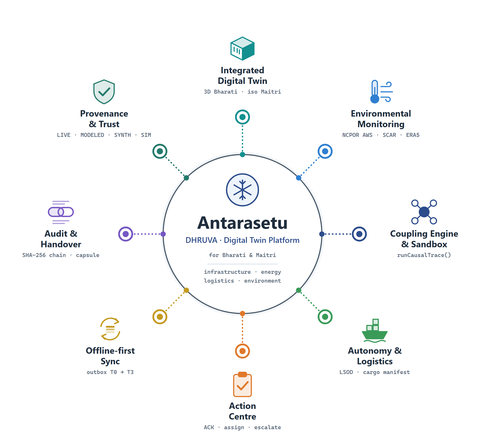
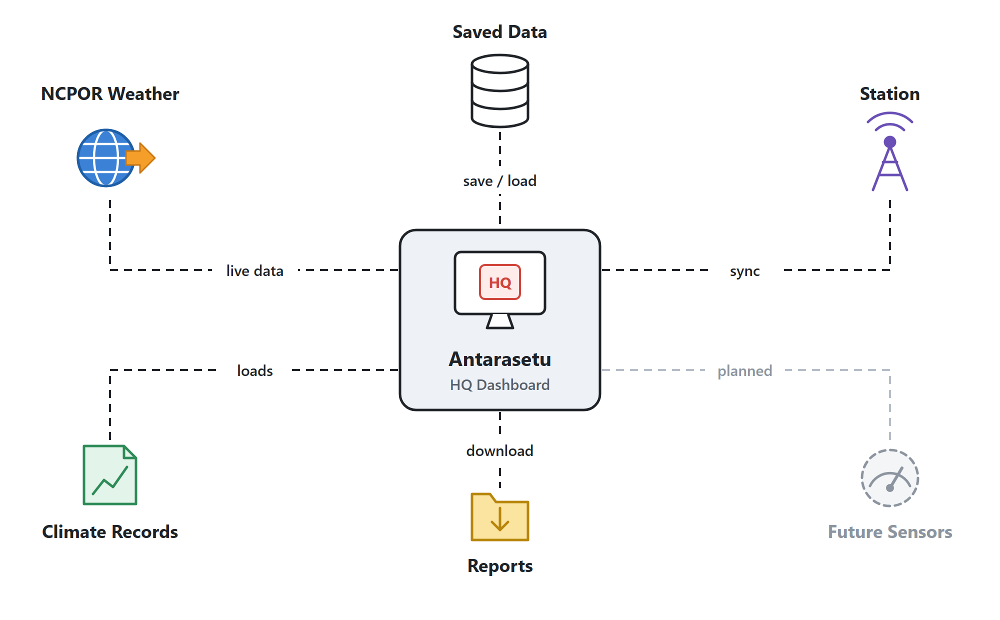
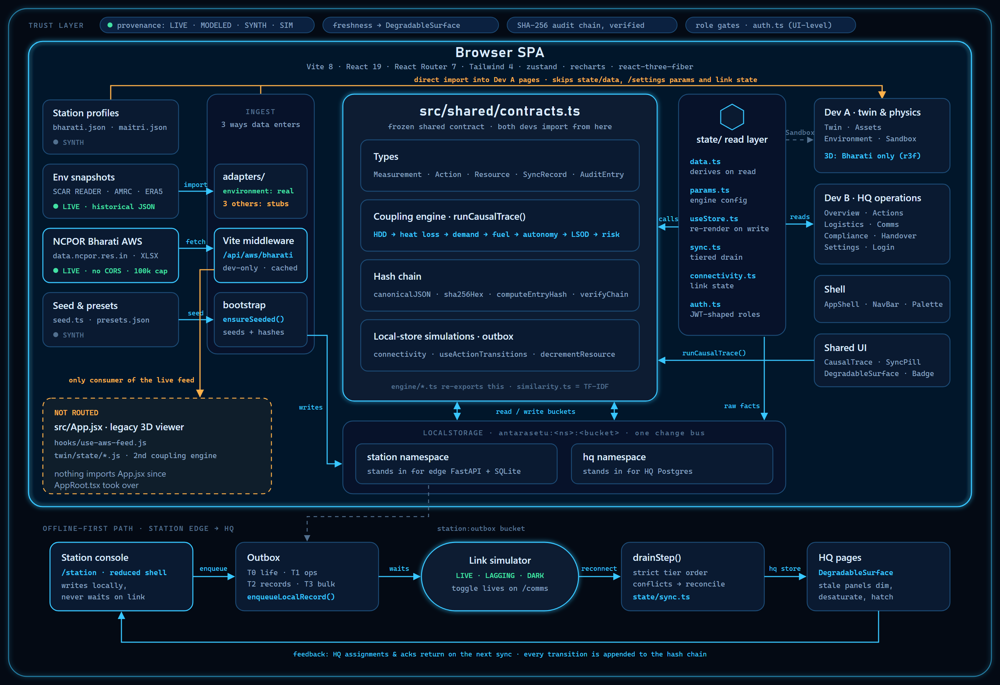
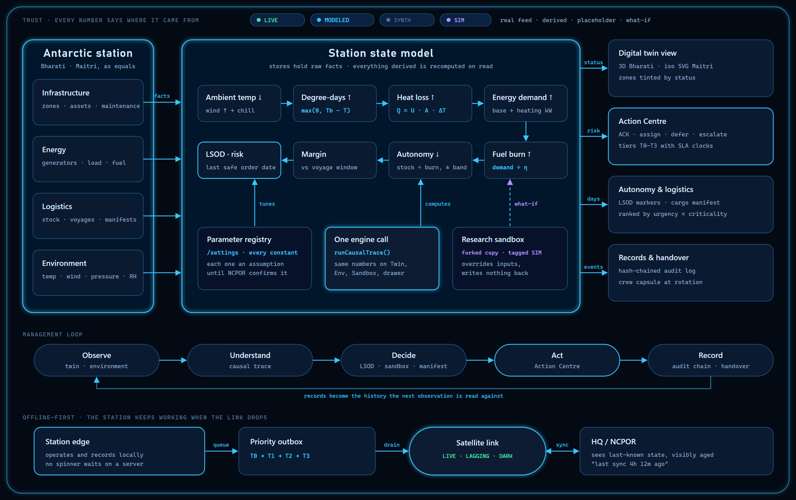

# Antarasetu (DHRUVA) architecture

Traced from `main @ a35f823` on 2026-09-30: router, the shared contract, `state/`, `engine/`, adapters, `server/`, and the import graph.

**What this repo is:** a frontend-only React SPA. The only server code is a dev-time Vite middleware that proxies the public NCPOR weather feed. Everything a backend would do (the station store, the HQ store, sync, audit, auth) is simulated in the browser on `localStorage`. All of it is built around one frozen contract file, `src/shared/contracts.ts`, which both developers import.

| | |
|---|---|
| Pages / routes | 13 pages on 16 routes |
| Shared contract | 1,126 lines (`src/shared/contracts.ts`) |
| Real external data feeds | 1 (NCPOR Bharati AWS) |
| Storage | 2 `localStorage` namespaces (`station`, `hq`) |
| Provenance classes | 4 (LIVE, MODELED, SYNTH, SIM) |

---

## Platform overview



*Vector version: [overview.svg](overview.svg)*

The platform sits at the centre; the eight capabilities around it are the product's core modules, each backed by real code in `src/`.

---

## Integration map



*Vector version: [integrations.svg](integrations.svg)*

Everything the HQ dashboard connects to. **Saved Data** is the browser's own storage. **NCPOR Weather** is the one live outside feed. **Climate Records** are saved weather files. **Station** is the station console, which syncs when the link is up. **Reports** are the files you can download. **Future Sensors** (fuel, generator, maintenance) are planned but not connected yet.

---

## 1. Technical diagram (as built)



*Vector version: [technical.svg](technical.svg)*

**How to read it**

- **Sources → Ingest.** Environment snapshots come in through `adapters/`. The NCPOR XLSX feed comes in through the Vite middleware at `/api/aws/bharati`. The seed data comes in through `bootstrap.ensureSeeded()`, which writes to `localStorage` and rebuilds the hash chain.
- **Centre: `contracts.ts`.** It holds the types, the coupling engine (`runCausalTrace()`), the SHA-256 hash chain, and the simulated stores (`connectivity`, `useActionTransitions`, `decrementResource`, the outbox).
- **`state/` read layer.** `data.ts` derives values on read by calling the engine. `params.ts` holds the engine settings. `useStore.ts` re-renders components whenever a store changes. Dev B's pages read through this layer.
- **Bottom row: the offline-first path.** Station console (`/station`) → outbox (T0 → T3) → link simulator (LIVE / LAGGING / DARK, toggled on `/comms`) → `drainStep()` in strict tier order → HQ pages, where `DegradableSurface` dims stale panels. Assignments and acknowledgements flow back to the station on the next sync.
- **Colour key:** cyan = call or data flow. Amber = a path that bypasses the intended layer. Dashed amber = code that no route reaches. Dashed grey = a partial link or a storage link.

## 2. Conceptual diagram



*Vector version: [conceptual.svg](conceptual.svg)*

Four domains (infrastructure, energy, logistics, environment) feed one station state model. Inside it, one cause-and-effect chain turns a drop in temperature into the date by which fuel must be ordered:

```
Ambient temp ↓ → degree-days ↑ → heat loss (Q = U·A·ΔT) ↑ → energy demand ↑
  → fuel burn ↑ → autonomy ↓ → margin vs voyage window → last safe order date & risk
```

The same function, `runCausalTrace()`, computes this chain on Twin, Environment, Sandbox and the Action Centre drawer. The Sandbox runs it on a forked copy of the inputs and writes nothing back. The model's outputs drive the twin view, the Action Centre, autonomy and logistics, and the records, following the loop **Observe → Understand → Decide → Act → Record**.

---

## 3. What the analysis found

| | Finding | Where |
|---|---|---|
| ⚠️ Gap | **The one real feed isn't used by any routed page.** Only `use-aws-feed.js` calls `/api/aws/bharati`, and only the orphaned `App.jsx` imports that hook. The middleware also runs only on the dev server (`apply: "serve"`), so a production build has no such endpoint. | `server/vite-plugin-ncpor.js`, `src/hooks/use-aws-feed.js`, `src/App.jsx` |
| ⚠️ Gap | **Dev A pages skip the state layer.** Twin, Environment and Assets import `mock/*.json` directly. They don't read the `/settings` parameters or the link state, so touchpoint #9 (going DARK degrades every page) can't pass on those pages yet. | `src/pages/Twin`, `src/pages/Environment`, `src/pages/Assets` |
| ⚠️ Gap | **Touchpoints #1 and #4 are `alert()` stubs.** The Twin zone inspector's ACK / Assign / Defer buttons and the Assets "Log service" button only show an alert. Neither calls `useActionTransitions()` or `decrementResource()`, which Dev B's pages already use. | [Twin/index.tsx:279-281](../../src/pages/Twin/index.tsx#L279-L281), [Assets/index.tsx:131](../../src/pages/Assets/index.tsx#L131) |
| ⚠️ Risk | **There are two coupling engines.** `twin/state/` holds a second engine of about 1,900 lines of JS. Only `App.jsx` uses it, so it's dead code today, but reviving it would break touchpoint #10 (identical numbers on every page). Delete it or fold it into `contracts.ts`. | `src/twin/state/*.js` vs `src/shared/contracts.ts` §2 |
| ℹ️ Note | **`engine/` mostly re-exports the contract.** Four of its five files only re-export `contracts.ts`. The only real code there is `similarity.ts`, the TF-IDF fault search. | `src/engine/*.ts` |
| ℹ️ Note | **Three of four adapters return null.** Only the environment adapter returns data (static snapshots). The fuel, generator and maintenance adapters are stubs, which matches their SYNTH labels. Maitri has no 3D model, so its Twin page falls back to the SVG iso view. | `src/adapters/*.adapter.ts`, [Twin/index.tsx:104](../../src/pages/Twin/index.tsx#L104) |
